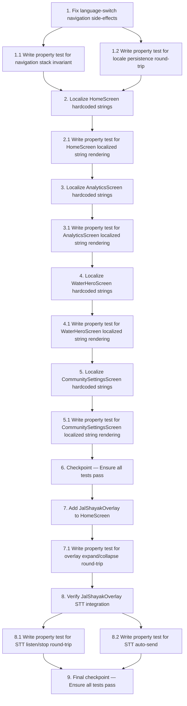

# Implementation Plan: Localization Completeness & Jal Shayak Integration

## Overview

Incremental implementation: fix language-switch navigation, replace hardcoded strings screen by screen, then wire up the Jal Shayak overlay on HomeScreen.

## Tasks

- [x] 1. Fix language-switch navigation side-effects
  - Audit `LanguageSelectorButton` and `LanguageSelectorDialog` in `lib/presentation/widgets/language_selector.dart` for any `Navigator.push/replace` calls after `changeLanguage` and remove them
  - Confirm `LanguageSelectorDialog` only calls `Navigator.pop` then `changeLanguage` — no further navigation
  - _Requirements: 1.1, 1.2, 1.3_

  - [ ]* 1.1 Write property test for navigation stack invariant
    - **Property 1: Language switch does not mutate the navigation stack**
    - Pump each screen widget, call `changeLanguage`, assert `Navigator.of(context).canPop()` is unchanged
    - **Validates: Requirements 1.1, 1.2, 1.3**

  - [ ]* 1.2 Write property test for locale persistence round-trip
    - **Property 2: Locale preference round-trip**
    - For each locale in `['en', 'hi']`, call `changeLanguage`, read `SharedPreferences`, assert equality
    - **Validates: Requirements 1.4**

- [x] 2. Localize HomeScreen hardcoded strings
  - In `lib/presentation/screens/home/home_screen.dart`, replace the 6 hardcoded strings (`'Voltage'`, `'Current'`, `'Session'`, `'Flow Rate'`, `'Learn about structure & setup'`, `'Explore educational resources'`) with `AppLocalizations.of(context)!.get(key)` calls per the design
  - _Requirements: 3.2, 3.3, 3.4, 3.5, 3.6, 3.7_

  - [ ]* 2.1 Write property test for HomeScreen localized string rendering
    - **Property 3: Screen widgets render localized strings for all locales (HomeScreen)**
    - Pump `HomeScreen` with each locale, find each `Text` widget, assert text matches `AppLocalizations(locale).get(key)`
    - **Validates: Requirements 3.1–3.8**

- [x] 3. Localize AnalyticsScreen hardcoded strings
  - In `lib/presentation/screens/analytics/analytics_screen.dart`, replace `'Insight'`, day-label strings, insight body strings, and `'CURRENT'`/`'PREDICTED'` legend labels with `AppLocalizations` keys per the design
  - Add `current` / `predicted` keys to `app_localizations.dart` if missing
  - _Requirements: 6.3, 6.4, 6.5_

  - [ ]* 3.1 Write property test for AnalyticsScreen localized string rendering
    - **Property 3: Screen widgets render localized strings for all locales (AnalyticsScreen)**
    - Pump `AnalyticsScreen` with each locale, assert localized text matches `AppLocalizations(locale).get(key)`
    - **Validates: Requirements 6.1–6.6**

- [x] 4. Localize WaterHeroScreen hardcoded strings
  - In `lib/presentation/screens/gamification/water_hero_screen.dart`, replace `'Daily Assignment'`, `'Your Rank'`, `'PENALTY ALERT'`, `'TOTAL WATER POINTS'`, `'Accept Task?'`, `'Yes'`, `'No'`, `'Task Completed'` with `AppLocalizations` keys per the design
  - _Requirements: 8.2, 8.3, 8.4, 8.5, 8.6_

  - [ ]* 4.1 Write property test for WaterHeroScreen localized string rendering
    - **Property 3: Screen widgets render localized strings for all locales (WaterHeroScreen)**
    - Pump `WaterHeroScreen` with each locale, assert localized text matches `AppLocalizations(locale).get(key)`
    - **Validates: Requirements 8.1–8.7**

- [x] 5. Localize CommunitySettingsScreen hardcoded strings
  - In `lib/presentation/screens/community_settings/community_settings_screen.dart`, replace `'Account'` section title, `'About Jal Dharan'`, `'Review our privacy practices'`, `'Read our terms of service'`, `'Sign out of your account'`, and logout dialog strings with `AppLocalizations` keys per the design
  - _Requirements: 9.2, 9.3_

  - [ ]* 5.1 Write property test for CommunitySettingsScreen localized string rendering
    - **Property 3: Screen widgets render localized strings for all locales (CommunitySettingsScreen)**
    - Pump `CommunitySettingsScreen` with each locale, assert localized text matches `AppLocalizations(locale).get(key)`
    - **Validates: Requirements 9.1–9.4**

- [x] 6. Checkpoint — Ensure all tests pass
  - Ensure all tests pass, ask the user if questions arise.

- [x] 7. Add JalShayakOverlay to HomeScreen
  - In `lib/presentation/screens/home/home_screen.dart`, add `const JalShayakOverlay()` as the last child of the root `Stack` (replacing the existing `// Jal Shayak Overlay` comment)
  - Ensure `JalShayakOverlay` is imported
  - _Requirements: 10.1, 10.2, 10.5_

  - [ ]* 7.1 Write property test for overlay expand/collapse round-trip
    - **Property 4: Overlay expand/collapse round-trip**
    - Pump `JalShayakOverlay`, tap collapsed button, tap close button, verify `_isExpanded == false`
    - **Validates: Requirements 10.3, 10.4**

- [x] 8. Verify JalShayakOverlay STT integration
  - Review `lib/presentation/widgets/jal_shayak_overlay.dart` to confirm `_listen()`, auto-send on final result (500ms delay), mic permission snackbar, and red mic indicator are all wired correctly — make any fixes needed
  - _Requirements: 11.1–11.8_

  - [ ]* 8.1 Write property test for STT listen/stop round-trip
    - **Property 5: STT listen/stop round-trip**
    - Mock `SpeechToText`, tap mic to start, tap mic again to stop, verify `_isListening == false`
    - **Validates: Requirements 11.4, 11.7**

  - [ ]* 8.2 Write property test for STT auto-send
    - **Property 6: STT final result triggers auto-send**
    - Mock `SpeechToText` to emit a final result with non-empty text, advance timer by 600ms, verify message appears in `_messages`
    - **Validates: Requirements 11.5**

- [x] 9. Final checkpoint — Ensure all tests pass
  - Ensure all tests pass, ask the user if questions arise.

## Task Dependency Graph

## Notes

- Tasks marked with `*` are optional and can be skipped for a faster MVP
- Screens already compliant (`HomeDigitalTwin`, `KnowledgeHubScreen`, `MapGrindScreen`, `RainwaterHarvestingScreen`) require no changes per the design audit
- Property tests use `flutter_test` with `fake_async` for timer control
